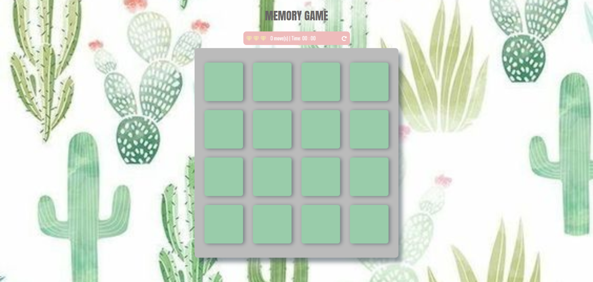
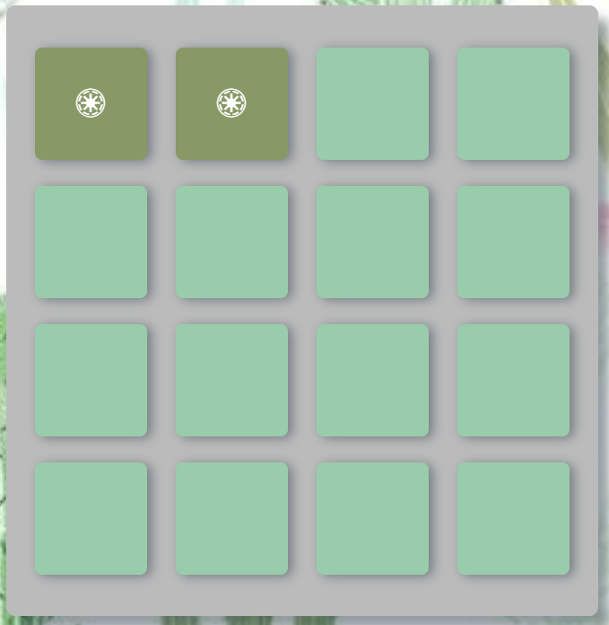
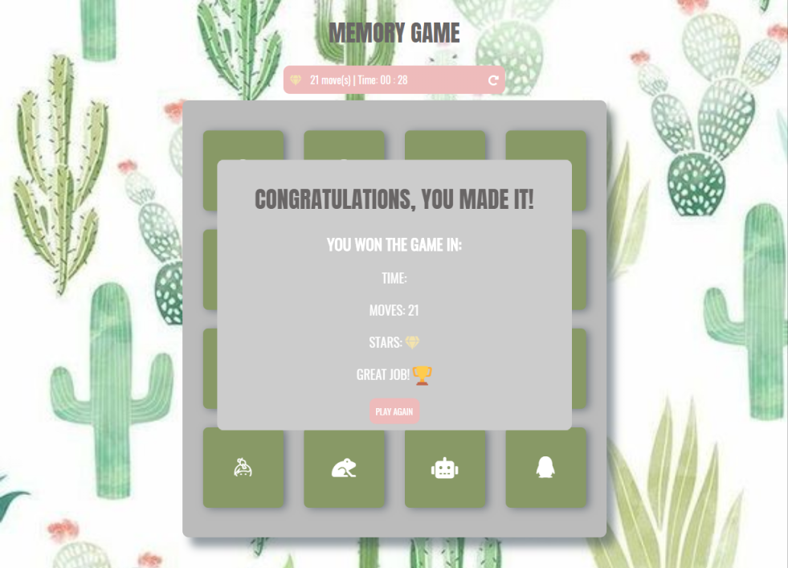

# Memory Game
This game is a lot of fun, it's the third project, and was made during the nanodegree of Udacity. 

# Deployment
Here is the link to view this project live, please click it below:

<a href="https://cveiga819.github.io/memory_game/">Memory Game</a>

## Instructions

* ### The goal of the game is to fmatch the pairs of cards in the shortest time and moves possible. In total there are 16 cards, so 8 pairs to win the game.

* ### Above the deck is the score-panel, where the player can view the moves, time, and reset the game.

* ### If you click on the reset button, all the cards will go to flipped down, you will start again and your score starts from the beggining.

* ### The game is finished, when all the pairs (8) are found and match. 

* ### when the player finishes the game, a popup will be shown, with the score and a button to click if you want to play again, reseting all game and scores.  

# Built with

# Author

* Catarina Veiga

# Aknowlegments

* Working on this project was quite tricky for me, but I'll admit it was quite challenging;

